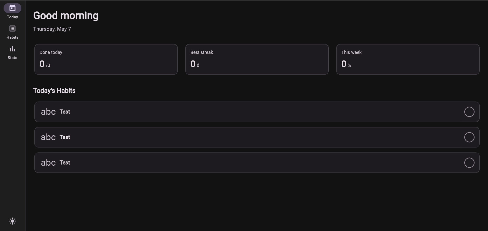
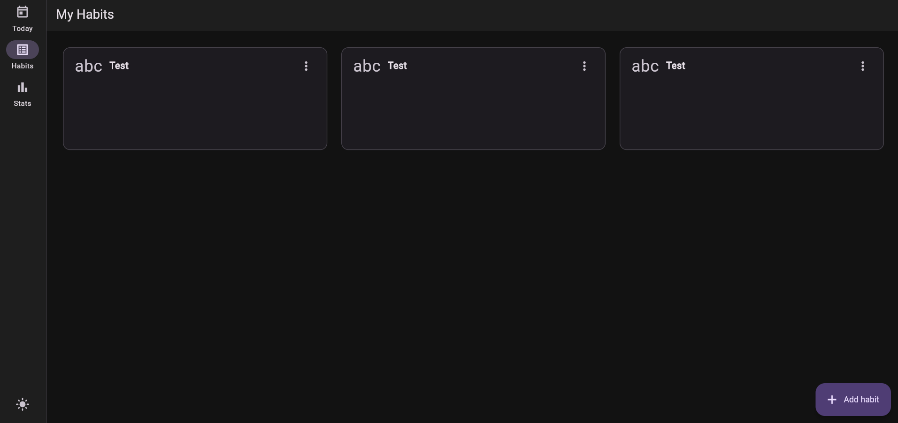
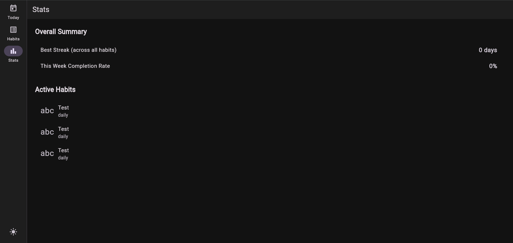

# 🚀 Habit Tracker

A modern, full-stack habit tracking application built to help you stay consistent and hit your daily goals! 

This repository contains both the **Flutter Web** frontend and the **Dart Shelf** backend, wired up with a lightning-fast SQLite database.

## 📸 Screenshots

<p align="center">
  
  
  
</p>

## ✨ Features

- **Dashboard & Analytics:** See your daily progress, weekly completion rates, and your best active streaks at a glance.
- **Custom Frequencies:** Track daily habits, or schedule them for specific days of the week (e.g., Mon, Wed, Fri).
- **Light/Dark Mode:** A beautiful interface that respects your eyes, whether it's 8 AM or 2 AM.
- **Micro-interactions:** Enjoy a burst of confetti when you crush all your habits for the day! 🎉

## 🛠️ Tech Stack

- **Frontend:** Flutter (Web), Riverpod for state management, GoRouter for navigation.
- **Backend:** Dart Shelf (REST API).
- **Database:** SQLite (using the `sqlite3` Dart FFI).

## 🚀 Getting Started

### 1. Run the Backend

Navigate to the `server` directory, install dependencies, and start the Shelf server:

```bash
cd server
dart pub get
dart run bin/server.dart
```

The API will start running locally on `http://localhost:8080`.

### 2. Run the Frontend

In a new terminal window, navigate to the root directory, install dependencies, and start the Flutter Web server:

```bash
flutter pub get
flutter run -d web-server --web-port=5555
```

Open your browser and navigate to `http://localhost:5555`. 

## 🤝 Contributing

Feel free to fork this project, submit pull requests, or open an issue if you have a feature request or spot a bug!

---
*Built with ❤️ using Dart & Flutter.*
